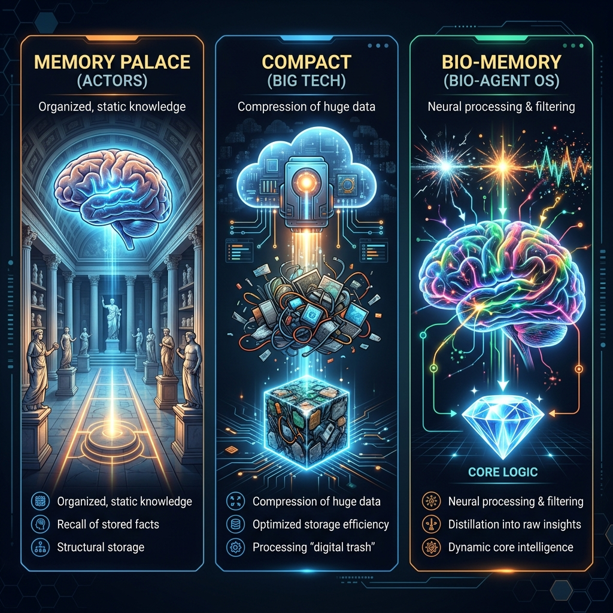

<p align="center">
  
</p>

<p align="center">
  <h1 align="center">🧠 Bio-Agent OS</h1>
  <p align="center"><strong>Open-source Bio-Inspired Memory Framework for AI Agents</strong></p>
  <p align="center"><em>"Biết nhớ · Biết quên · Biết tư duy"</em></p>
  <p align="center">Designed by <a href="https://locaith.com">Locaith Solution Tech</a> | 🇻🇳 Make in Vietnam</p>
</p>

---

## 🔬 Tại sao lại là Bio-Memory? (The "Why")

Trong kỷ nguyên AI bùng nổ, chúng ta đang đối mặt với 3 cách tiếp cận bộ nhớ hoàn toàn khác nhau. Hãy cùng so sánh để thấy tại sao **Bio-Agent OS** là tương lai của các AI Agent tự chủ:

### 🎭 1. Diễn viên Memory Palace (Memory Palace Actors) — "Hack Sinh Học"
- **Bản chất**: Con người dùng trí tưởng tượng để biến não bộ thành một "ổ cứng" tĩnh. Đặt dữ liệu vào các căn phòng ảo.
- **Nhược điểm**: Cực kỳ tốn năng lượng (kiệt quệ sinh học). Truy xuất theo trình tự, chậm chạp. Dữ liệu là "chết", không có khả năng tự tiến hoá.

### ☁️ 2. "Compact" của Big Tech (ChatGPT/Claude) — "Hack Đám Mây"
- **Bản chất**: Cố gắng nhồi nhét càng nhiều token càng tốt. Khi đầy bộ nhớ (Context Window), họ dùng thuật toán nén.
- **Sự thật phũ phàng**: Đây là quá trình **nén rác thành một đống rác nhỏ hơn**. Hệ thống vẫn phải gánh toàn bộ "nhiễu" (noise), dẫn đến ảo giác (hallucination) nghiêm trọng và tốn kém tài nguyên một cách vô nghĩa.

### 🧬 3. Bio-Memory của AgentOS — "Hack Nhận Thức"
- **Bản chất**: Mô phỏng cơ chế **Quên để Nhớ** của não người. 
- **Đặc điểm**:
  - **Lọc (Filtering)**: Loại bỏ rác và cảm xúc thô ngay lập tức.
  - **Tỉa (Pruning)**: Xoá bỏ những nơ-ron thông tin không quan trọng theo thời gian.
  - **Chuyển hoá (Consolidation)**: Biến hàng ngàn "Sự kiện" rườm rà thành một viên kim cương **Logic Cốt Lõi** duy nhất. AI của bạn không chỉ nhớ, nó thực sự "NGỘ" ra chân lý.

---

## 🏗️ Kiến trúc Framework (Core Architecture)

| Thành phần | Chức năng | Cơ quan tương ứng |
|:---:|:---|:---:|
| 🟢 **L1 Buffer** | Lưu trữ hội thoại gần đây & dữ liệu thô. | **Prefrontal Cortex** |
| 🔵 **L2 Semantic** | Tìm kiếm vector & Suy giảm trí nhớ Ebbinghaus. | **Neocortex** |
| 🟡 **Persona** | Lưu trữ Hộp Đen Cốt Lõi (vĩnh viễn). | **Core Identity** |
| 🔴 **Knowledge Graph** | Mapping các thực thể & mối quan hệ. | **Association Areas** |
| ⚙️ **Hippocampus** | Tiến trình Ngủ: Nén kinh nghiệm → Logic. | **Sleep Cycle** |
| ✂️ **Pruner** | Thợ vườn: Chặt tỉa rác & thông tin hết hạn. | **Synaptic Pruning** |

---

## 🔄 Luồng vận hành (The Pipeline)

1. **Gửi tin nhắn (Real-time)**: 
   - `Router` phân loại: Chat chơi hay là hỏi kiến thức? 
   - Hệ thống kéo L1 (vừa mới nói) + L2 (kiến thức cũ) + Persona (bản sắc) → Trả lời ngay lập tức.
2. **Khi hệ thống rảnh (Idle/Sleep)**: 
   - `GarbageCollector` thức dậy quét sạch rác ở L1.
   - `Hippocampus` nén các sự kiện quan trọng thành **Logic Luật**.
   - `GraphBuilder` trích xuất các mối quan hệ mới vào Đồ thị tri thức.

---

## 🚀 Cài đặt siêu tốc

```bash
# Cài đặt framework bản mới nhất
pip install bio-agent-os[gemini]
```

### Sử dụng như một Thư viện (Quick Start)

```python
import asyncio
from bio_agent_os import LLMEngine, L1WorkingMemory, Persona, Hippocampus, GarbageCollector

async def main():
    # 1. Khởi tạo CPU (LLM) và Bộ não
    engine = LLMEngine(backend="gemini", model_id="gemini-3-flash-preview")
    l1 = L1WorkingMemory(agent_name="my-bio-ai")
    persona = Persona(name="my-bio-ai")
    hippo = Hippocampus(engine=engine, l1=l1, persona=persona)

    # 2. Nạp dữ liệu thô (Real-time)
    await hippo.label_and_store("BUG: Database timeout vì thiếu Index", source="dev-log")
    
    # 3. Kích hoạt 'Ngủ' để chuyển hoá kiến thức (Sleep Cycle)
    await hippo.consolidate()
    
    # 4. Xem AI đã 'ngộ' ra điều gì
    print(persona.get_identity_prompt())
    # Output: "Luật: Luôn kiểm tra Index khi truy vấn Database lớn."

asyncio.run(main())
```

---

## 🌏 Sứ mệnh: Sovereign AI (AI Chủ Quyền)

**Bio-Agent OS** được thiết kế để giải quyết bài toán chạy AI Local (On-premise) cho các doanh nghiệp:
- **Tiết kiệm phần cứng**: Không cần hàng ngàn GPU để chứa Context khổng lồ.
- **Bảo mật tuyệt đối**: Dữ liệu được tiêu huỷ định kỳ, chỉ giữ lại tri thức cốt lõi.
- **Tiến hoá vĩnh viễn**: Hệ thống không bao giờ bị tràn bộ nhớ hay chậm đi theo thời gian.

---

<p align="center">
  <strong>Bio-Agent OS</strong> — 🇻🇳 Make in Vietnam with 🧠<br>
  <em>Designed for the next generation of Autonomous Agents.</em>
</p>
