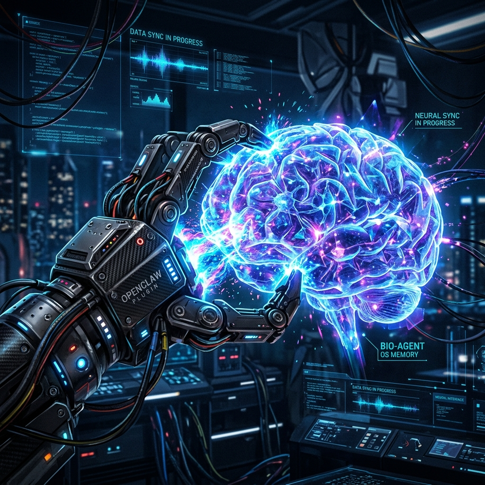
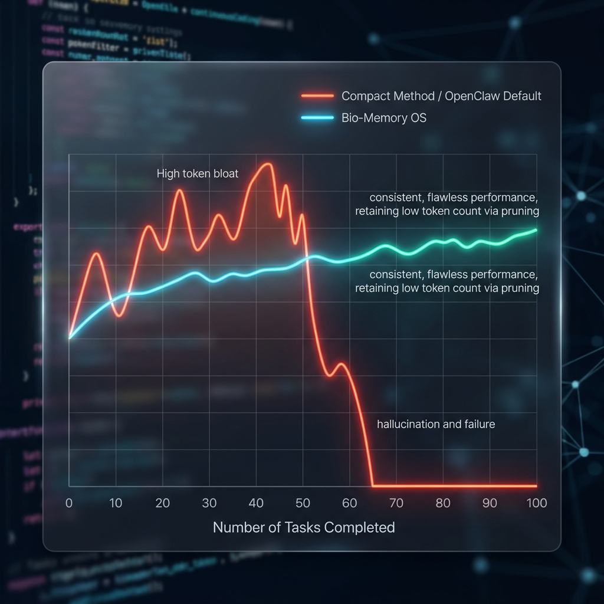

<p align="center">
  
</p>

<p align="center">
  <h1 align="center">🧠 Bio-Agent OS v0.2.0</h1>
  <p align="center"><strong>The Biological Memory Upgrade for OpenClaw & Autonomous Agents</strong></p>
  <p align="center"><em>"Biết nhớ · Biết quên · Biết tư duy"</em></p>
  <p align="center">Designed by <a href="https://locaith.com">Locaith Solution Tech</a> | 🇻🇳 Make in Vietnam</p>
</p>

---

## 🚀 Sứ mệnh: The "Trojan Horse" cho OpenClaw & OpenDevin

Bạn đang dùng Agent mã nguồn mở như **OpenClaw, OpenDevin, hay SWE-agent**? Agent của bạn chạy task rất giỏi nhưng... **càng lúc càng ngu đi và tốn kém Token?**

Vấn đề của các Autonomous Agent hiện tại là chúng xài bộ nhớ như một bãi rác (Vector DB nhồi nhét mọi log terminal dài ngoằng). Chúng tốn hàng triệu token để duy trì ngữ cảnh nhưng KHÔNG BAO GIỜ học được một **Quy luật** nào cho dự án cụ thể. 

Lắp **Bio-Agent OS** vào làm backend Memory là bạn đang trang bị một bộ não sinh học vượt trội cho OpenClaw. Chuyển đổi Agent của bạn từ một cỗ máy "bạo lực Token" thành một 엔티티 (Thực thể) biết tự tiến hoá.

### Lợi ích "Độc Tôn" khi cắm Bio-Memory vào OpenClaw:
1. **Chống Tràn RAM tuyệt đối (Garbage Collection)**: Cắt tỉa các terminal log vô nghĩa, xóa bỏ các bước "thử và sai" rùng rợn, giữ lại output cốt lõi nhất.
2. **Học "Luật Bất Biến" (Encoding Shift)**: Tự động đúc kết lại lỗi đã gặp thành một Luật vĩnh viễn (Persona): *"Luật 04: Cấm dùng git push -f trong dự án frontend"*. OpenClaw sẽ lập tức code chuẩn trong task tiếp theo mà không cần chèn thêm context.
3. **Cơ chế Ngủ (Micro-Sleep cycles)**: Sau mỗi 10 lệnh command, OpenClaw sẽ "đi ngủ" để Hồi Hải Mã (Hippocampus) nén tri thức.

---

## 📊 So Sánh: Compact (Big Tech) vs Bio-Memory (Coding Sessions)

Dưới đây là biểu đồ mô phỏng hiệu suất và lượng Token sụp đổ rùng rợn của phương pháp "Compact" (nén rác thành rác) so với sự ổn định tuyệt đối của Bio-Memory khi code liên tục 100 tác vụ trong OpenClaw.

<p align="center">
  
</p>

* **Compact (Đường màu Đỏ)**: Token phình to nhanh chóng → Mất Context (Hallucination) → Crash hoàn toàn tại Task thứ 50 do không thể xử lý nổi lượng rác tích tụ.
* **Bio-Memory (Đường màu Xanh/Cyan)**: Trễ nhịp tí xíu chạy Background Sleep Cycle, nhưng duy trì VRAM tối ưu và độ chính xác hoàn hảo 100% kể cả ở Task thứ 1000.

---

## 🏗️ Kiến trúc Framework cốt lõi (Core Architecture)

| Thành phần | Chức năng (Ứng dụng cho OpenClaw) | Cơ quan tương ứng |
|:---:|:---|:---:|
| 🟢 **L1 Buffer** | Bộ đệm Terminal Logs & Code diffs ngắn hạn. | **Prefrontal Cortex** |
| 🔵 **L2 Semantic** | Semantic Search Vector Codebases + Ebbinghaus Decay. | **Neocortex** |
| 🟡 **Persona** | Hệ thống Rules (Luật) "nhập vai" vĩnh viễn. | **Core Identity** |
| 🔴 **Knowledge Graph** | Đồ thị luồng dữ liệu (Graph Dependencies) của hệ thống code. | **Association Areas** |
| ⚙️ **Hippocampus** | Biến "lỗi terminal dài 1MB" thành "1 câu Error Rules". | **Sleep Cycle** |
| ✂️ **Pruner** | Tiêu huỷ code vứt đi và file configs rác sau khi xong task. | **Synaptic Pruning** |

---

## 🚀 Cài đặt Siêu Tốc

```bash
# Cài đặt framework bản mới nhất (có sẵn adapter)
pip install bio-agent-os[gemini]
```

### Sử dụng OpenClaw Adapter (Preview)

Chúng tôi cung cấp sẵn một Blueprint `OpenClawBioAdapter` trong thư mục `bio_agent_os.adapters` để bạn cắm thẳng vào vòng lặp của tác vụ.

```python
import asyncio
from bio_agent_os import LLMEngine, L1WorkingMemory, Persona, Hippocampus, GarbageCollector
from bio_agent_os.adapters.openclaw_adapter import OpenClawBioAdapter

async def main():
    # 1. Khởi tạo Brain
    engine = LLMEngine(backend="gemini", model_id="gemini-3-flash-preview")
    l1 = L1WorkingMemory(agent_name="openclaw-brain")
    persona = Persona(name="openclaw-brain")
    hippo = Hippocampus(engine=engine, l1=l1, persona=persona)
    gc = GarbageCollector(l1=l1)

    # 2. Khởi tạo Adapter
    adapter = OpenClawBioAdapter(hippocampus=hippo, garbage_collector=gc, persona=persona)

    # 3. Simulate Pipeline của OpenClaw chạy lệnh terminal
    await adapter.ingest_observation("run_command", "npm ERR! cb() never called!")
    
    # Kích hoạt Sleep Mode bằng tay hoặc chờ đủ limit
    await adapter.trigger_micro_sleep()
    
    # 4. Trích xuất rules bơm ngược lại vào System Prompt OpenClaw
    print(adapter.inject_persona_to_openclaw())

asyncio.run(main())
```

---

## 🌏 Tầm Nhìn & Open-source Commitment

**Bio-Agent OS** không phải là LLM model. Chúng tôi là **"Memory Controller"** — bộ phận quyết định trí thông minh lâu dài của các mô hình. 
Chúng tôi mong muốn hỗ trợ toàn diện các nền tảng Agent hiện tại. Hãy đồng hành cùng Locaith Solution Tech định hình tương lai của Sovereign AI.

---

## 📬 Liên hệ & Triển khai doanh nghiệp

Hệ thống **Bio-Agent OS** được nghiên cứu và phát triển bởi Đội ngũ **Locaith Solution Tech**, đứng đầu bởi **Dev Tuấn Anh** (Top 4 Google for Startups Accelerator). Nếu bạn cần triển khai kiến trúc Bio-Memory tinh chỉnh cho dữ liệu khép kín của tổ chức, hãy liên hệ:

- 🏢 **Công ty**: Locaith Solution Tech 
- 📍 **Địa chỉ**: Số 5 Mạc Thị Bưởi, Vĩnh Tuy, Hai Bà Trưng, Hà Nội, Việt Nam
- ✉️ **Email Tổ chức**: locaithsolution@locaith.com
- ✉️ **Email Cá nhân (Dev Tuấn Anh)**: tuananhnangluong@gmail.com
- 📞 **Hotline**: 0966 872 591
- 🌐 **Website**: [https://locaith.com](https://locaith.com)
- ▶️ **YouTube**: [@locaithSolution](https://youtube.com/@locaithSolution)
- 🔵 **Facebook**: [Locaith Fanpage](https://www.facebook.com/profile.php?id=61560965389617)

<p align="center">
  <strong>Bio-Agent OS v0.2.0</strong> — Nghệ thuật kiểm soát Siêu Trí Tuệ<br>
  <em>Designed with 🧠 by Locaith Solution Tech | 🇻🇳 Make in Vietnam</em>
</p>

