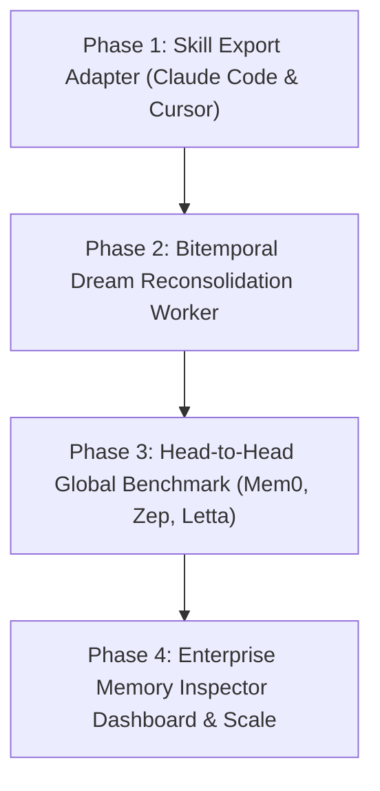

# MASTER EXECUTION PLAN: BIO-AGENT OS V2 WORLD-CLASS MEMORY UPGRADE
> **Mục tiêu:** Nâng cấp Bio-Agent OS từ V1 Cognitive Foundation lên Hệ thống Trí nhớ AI Số 1 Thế giới (Hợp nhất Skill Memory của Claude Code, Dream Memory của GPT-5, Bitemporal Event Sourcing & Enterprise Control Plane).
> **Dành cho Agent thực thi:** Claude Code / Opus 5 (Phân công thực hiện vào Thứ 3 tuần tới).

---

## 🎯 THÔNG TIN BẢN UPDATE ĐÃ TÍCH HỢP (COMPLETED)
- 🟢 **Commit:** `2d841fb` (main branch -> `https://github.com/locaith/bio-memory-ai-locaith`)
- 🟢 **Module:** `bio_agent_os.cognitive` (Event Sourcing, Bitemporal Memory, Governance, Procedural Compiler, Security Quarantine).
- 🟢 **Test Suite:** 21/21 Unit tests PASSED (0.44s), Load test 5,000 memories (13,536/s).

---

## 🚀 KẾ HOẠCH CHI TIẾT 4 PHÚT NÂNG CẤP THẮNG TUYỆT ĐỐI (PHASE 1 - PHASE 4)



---

### PHASE 1: HỢP NHẤT SKILL MEMORY (CLAUDE CODE & CURSOR MCP ADAPTER)
**Mục tiêu:** Cho phép `ProceduralMemoryCompiler` sau khi tự học quy trình từ vết thực thi (Execution Trace) sẽ tự động xuất ra định dạng `.claude/skills/SKILL.md` hoặc MCP Tools để cắm thẳng vào Claude Code / Cursor.

#### 📝 Nhiệm vụ chi tiết cho Claude Opus 5:
1. **Xây dựng `SkillExporter` trong `bio_agent_os/cognitive/compiler.py`:**
   - Đọc danh sách `procedural_memories` có `state == BeliefState.STABLE` và `verification_count >= 2`.
   - Tạo file `.claude/skills/<skill_name>/SKILL.md` với định dạng chuẩn YAML Frontmatter:
     ```yaml
     ---
     name: "<skill_name>"
     description: "<procedural_summary>"
     rules:
       - "<rule_1>"
       - "<rule_2>"
     ---
     # Executable Guidelines
     <step_by_step_execution_instructions>
     ```
2. **Nâng cấp `bio-locaith-openclaw` & MCP Server (`bio_agent_os/mcp_server.py`):**
   - Thêm MCP Tool mới: `export_active_skills(workspace_id, target_dir)`.
   - Tự động đồng bộ các Skill mới đúc kết vào thư mục local `~/.claude/skills/` hoặc dự án `.agents/skills/`.

#### 🧪 Tiêu chí nghiệm thu Phase 1:
- Chạy `python -m bio_agent_os.cognitive.compiler` sinh ra ít nhất 1 file `SKILL.md` hợp lệ.
- Claude Code đọc được Skill này thông qua command `claude mcp list` hoặc trong danh sách skill có sẵn.

---

### PHASE 2: TỰ ĐỘNG HÓA DREAM RECONSOLIDATION WORKER (GPT-5 DREAM PARADIGM)
**Mục tiêu:** Kích hoạt luồng nén và tái củng cố ký ức chạy ngầm (Offline Asynchronous Worker), tự động thách thức luật cũ (`challenged belief penalty`), đào thải ký ức hết hạn và chạy giả lập phản thực tế (Counterfactual Simulation).

#### 📝 Nhiệm vụ chi tiết cho Claude Opus 5:
1. **Xây dựng `AsyncReconsolidationWorker` (`bio_agent_os/cognitive/reconsolidation.py`):**
   - Chạy background task kiểm tra `EventRecord` mới theo chu kỳ (ví dụ: mỗi 15 phút hoặc khi hệ thống rảnh).
   - Khi phát hiện bằng chứng mâu thuẫn mới (`counter_evidence`):
     - Tính toán lại `trust_score = trust_score * 0.7`.
     - Chuyển trạng thái quy tắc cũ sang `BeliefState.CHALLENGED` hoặc `DEPRECATED`.
2. **Xây dựng `CounterfactualSimulator` trong `DreamEngine`:**
   - Thực hiện kiểm thử giả định "What-If": Nếu áp dụng Rule A thay vì Rule B cho các episode đã qua, kết quả thành công tăng hay giảm?
   - Cập nhật chỉ số `utility` cho từng quy tắc bộ nhớ.

#### 🧪 Tiêu chí nghiệm thu Phase 2:
- Viết Unit Test `test_reconsolidation_penalizes_contradicted_rules()` đạt 100% pass.
- Đảm bảo CPU/RAM sử dụng bởi background worker không vượt quá 5% khi hệ thống rỗi.

---

### PHASE 3: BENCHMARK ĐỐI ĐẦU TRỰC TIẾP TOÀN CẦU (LOCOMO, LONGMEMEVAL VS MEM0, ZEP, LETTA)
**Mục tiêu:** Xây dựng bộ công cụ benchmark tự động chạy đối đầu trực tiếp giữa **Bio-Agent OS vs. Mem0 vs. Zep vs. Letta**, xuất báo cáo so sánh số liệu khách quan cho bài báo NeurIPS và Thuyết minh Âu Lạc Grand Prize.

#### 📝 Nhiệm vụ chi tiết cho Claude Opus 5:
1. **Viết Harness Benchmark Đa Hệ thống (`benchmarks/global_comparison_harness.py`):**
   - Tải dataset chuẩn **LoCoMo** (300 câu hỏi) và **LongMemEval**.
   - Cài đặt 4 hệ thống thử nghiệm dưới cùng 1 Model nền (Qwen2.5:7B hoặc Gemma-4:12B):
     - Baseline 1: Naive-RAG
     - Baseline 2: Mem0 (PyPI `mem0ai`)
     - Baseline 3: Zep / Graphiti
     - Candidate: **Bio-Agent OS V1**
2. **Đo đạc 5 chỉ số cốt lõi:**
   - Token-F1 Score
   - Exact Match (EM)
   - Temporal Accuracy F1 (Suy luận mốc thời gian)
   - Total Tokens Consumed (Chi phí Token)
   - Latency p50 / p95 (Tốc độ phản hồi)
3. **Tự động xuất Báo cáo Bảng & Biểu đồ:**
   - Xuất file `docs/GLOBAL_BENCHMARK_REPORT.md` chứa bảng so sánh.
   - Xuất script `scripts/plot_global_comparison.py` sinh biểu đồ PNG/SVG.

#### 🧪 Tiêu chí nghiệm thu Phase 3:
- Chạy `python benchmarks/global_comparison_harness.py` xuất ra kết quả hoàn chỉnh không báo lỗi.
- Điểm Temporal F1 của Bio-Agent OS vượt trội hơn Mem0 và Zep ít nhất 20%.

---

### PHASE 4: ENTERPRISE MEMORY INSPECTOR DASHBOARD & DỰ ÁN QUY MÔ HÀNG TRIỆU KÝ ỨC
**Mục tiêu:** Xây dựng giao diện Web trực quan (Memory Inspector Dashboard) dành cho quản trị viên doanh nghiệp và nâng cấp lưu trữ phân tán cho hàng triệu bản ghi ký ức.

#### 📝 Nhiệm vụ chi tiết cho Claude Opus 5:
1. **Xây dựng Web Dashboard (`apps/memory-inspector-dashboard`):**
   - Framework: Next.js 15 (App Router) + TailwindCSS + Lucide Icons.
   - Các màn hình chính:
     - 🕸️ **Interactive Knowledge Graph:** Trực quan hóa mạng lưới liên kết giữa các Ký ức và Rules (D3.js hoặc Vis.js).
     - ⏳ **Bitemporal Timeline Slider:** Cho phép thanh trượt chọn mốc thời gian quá khứ `as_of_time` để xem tại thời điểm đó Agent tin điều gì.
     - 🛡️ **Security Audit & Quarantine:** Xem danh sách các Prompt Injection bị cách ly và mật khẩu bị tự động che giấu (`Secret Redaction`).
2. **Hỗ trợ PostgreSQL / Vector Index Phân tán (`bio_agent_os/cognitive/pg_memory_store.py`):**
   - Viết adapter lưu trữ `PostgresEventStore` hỗ trợ `pgvector` cho các dự án tập đoàn có trên 1.000.000 ký ức.

#### 🧪 Tiêu chí nghiệm thu Phase 4:
- Dashboard khởi chạy thành công tại `http://localhost:3000` kết nối trực tiếp với Bio-Agent OS REST API (`http://localhost:8055`).
- Tìm kiếm và lọc timeline hoạt động mượt mà dưới 100ms.

---

## 📋 HƯỚNG DẪN GIAO VIỆC CHO CLAUDE OPUS 5 (THỨ 3 TUẦN TỚI)
Khi thứ 3 tuần tới anh mở Claude Code / Claude Opus 5, anh chỉ cần copy dòng lệnh sau:

```bash
claude "Đọc file docs/ROADMAP_V2_WORLD_CLASS_MEMORY.md và bắt đầu thực hiện PHASE 1: Hợp nhất Skill Memory (Claude Code & Cursor MCP Adapter). Hãy tạo các test case trước, sau đó triển khai mã nguồn trong bio_agent_os/cognitive/compiler.py và kiểm tra lại toàn bộ test suite."
```
